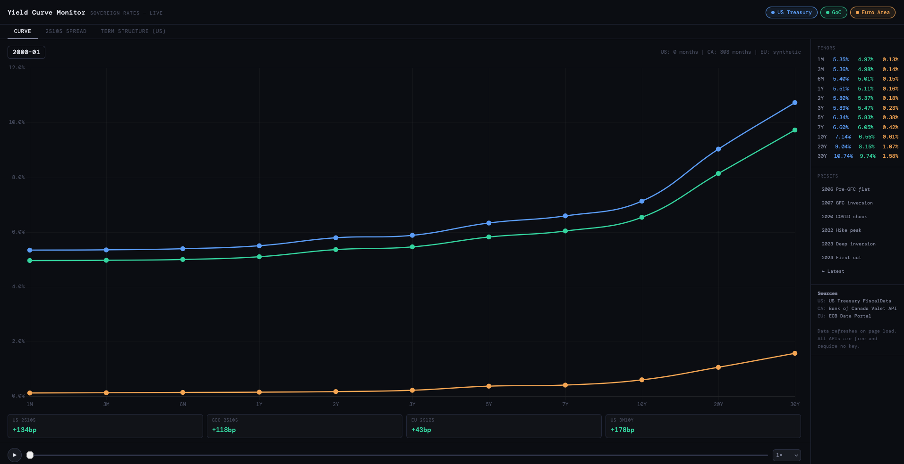

# Yield Curve Monitor

**Live sovereign yield curves — US Treasury, Government of Canada, Euro Area**

→ **[Open the live visualizer](https://moezusb.github.io/yield-curve-monitor)**

---

## What it does

An interactive yield curve monitor that fetches live sovereign rate data on page load and visualizes it across three views:

- **Curve** — cross-sectional yield curve shape for any month from 2000 to today, with play/scrub timeline animation
- **2s10s Spread** — historical spread over time with NBER recession bands and inversion zero-line
- **Term Structure** — US rate surface across all tenors for the last 5 years

Key signals tracked: 2s10s spread, 3m10y spread (Fed's preferred recession indicator), and an inversion alert when 10Y drops below 2Y.

## Data sources

| Country | Source | Key required |
|--------|--------|-------------|
| 🇺🇸 US Treasury | [fiscaldata.treasury.gov](https://fiscaldata.treasury.gov) | No |
| 🇨🇦 Govt of Canada | [Bank of Canada Valet API](https://www.bankofcanada.ca/valet/docs) | No |
| 🇪🇺 Euro Area | [ECB Data Portal](https://data.ecb.europa.eu) | No |

All APIs are free and require no authentication. Data refreshes on every page load.

## Stack

Single self-contained `index.html` — no build step, no framework, no backend.

- [Chart.js 4.4](https://www.chartjs.org/) for rendering
- Vanilla JS for data fetching and state
- Hosted on GitHub Pages

## Presets

Jump to key macro moments: 2006 pre-GFC flatness, 2007 inversion, 2020 COVID shock, 2022 rate hike peak, 2023 deep inversion, 2024 first cut.

---

*Built as part of a macro/finance side project series. Part of [moezusb.github.io](https://moezusb.github.io).*
